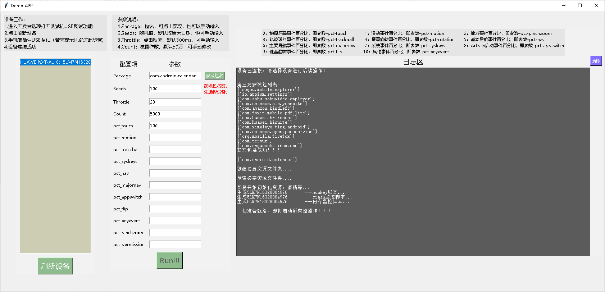

# Monkey_GUI
Windows Monkey Test GUI Demo

## Requirement
- re modules
```shell
pip install re
```
- Android ADB

```shell
adb --version
```

- device connect to PC by using USB
```shell
adb devices -l
```

## Launch Panel
```shell
python3 monkey_tools.py
```

## Notation
```txt
1. Current Only Support Windows Plateform 
2. Default Config Params define in .txt as JSON
```

## TODO
- 1.Support Other Plate(Mac\Linux) GUI 
- 2.Optimize Source code

## Procedure
- 1. USB Link Mobile Devices
- 2. Open Mobile's Software Which You Want To Test
- 3. ADB Check Devices Link
- 4. Flush Devices(刷新设备)
- 5. Click Obtain Package Button（获取包名）
- 6. define percent for action part
- 7. Click 'Run!!!' 

## Software Interface
